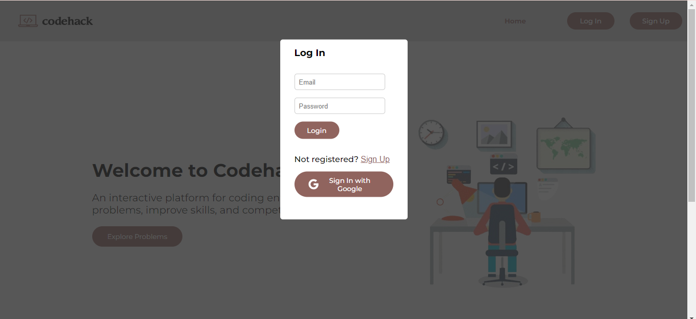

# Codehack-Online Judge

Codehack is an online coding platform created with the MERN stack (MongoDB, ExpressJS, ReactJS, NodeJS). It offers users the ability to solve programming problems, submit their solutions, and check the results. The platform includes essential features such as user authentication, problem management and the ability to compile and execute code securely in an isolated environment.

## Table of Contents
1.Screenshots  
2.Features  
3.Technologies Used  
4.Setting up the project  
5.Running the project  

## Screenshots

### 1.Home Page(User can access problems by topic directly from here)
<table>
        <tr> 
        <td></td>
        <td></td>
        </tr>
</table>

### 2.Login(along with Login with Google) and SignUp  
<table>
        <tr> 
        <td></td>
        <td></td>
        </tr>
</table>

### 3.View Problems and filter them according to Difficulty and Topic  
<table>
        <tr> 
        <td></td>
        </tr>
</table>

### 4.CRUD Functionality on the problems  
<table>
        <tr> 
        <td></td>
        <td></td>
        <td></td>
        </tr>
</table>

### 5.Problems Page to run on custom input and hidden test cases and user profile  
<table>
        <tr> 
        <td></td>
        <td></td>
        <td></td>
        </tr>
</table>


## Features:

#### 1. USER AUTHENTICATION:
- [x] Secure user login and session management using `JSON Web Tokens (JWT) and Cookie-based Authentication.` 
- [x] Includes Google sign-in for seamless and convenient user authentication.
  
### 2. Create,Read,Update,Delete(CRUD) management for problems
- [x] Problems can be created, read, updated, and deleted with an intuitive and user-friendly interface.
- [x] Supports the addition of constraints, input/output formats, and example test cases to provide clear problem specifications.

### 3. PROBLEM LIST PAGE:
- [x] Lists all available problems. Users can select a problem to view details, run code, and submit solutions.
- [x] Users can submit solutions in C++, C, or Python.
- [x] Problems filtered by difficulty and by topic can be viewed.

### 4. CODE EXECUTION AND SUBMISSION:
- [x] Isolates the execution environment of the submitted code, ensuring secure and consistent execution without affecting the host system using `Docker`.
- [x] Executes submitted code against sample and hidden test cases.
- [x] Dependencies: `uuid, fs, path, child_process`

### 5. User Profile Page
- [x] Displays the user's profile with information, including the total number of problems solved.
- [x] Lists the titles of the problems that the user has successfully solved, providing a clear overview of their accomplishments.

## Technologies Used:  
### Backend:
bcrypt: Secure password hashing and salting  
bcryptjs: JavaScript-based password hashing library  
cookie-parser: Middleware for cookie parsing  
express: Fast, minimalist web framework  
express-session: Session management for Express apps  
jsonwebtoken: Create and verify JWTs  
mongoose: MongoDB object modeling for Node.js  
passport: Authentication middleware for Node.js  
passport-google-oauth2: Google OAuth2 authentication strategy  
uuid: Generate unique identifiers (UUIDs)  

### Frontend:
React: Library for building user interfaces  
React Router: Declarative routing for React apps  
CSS Modules:Scoped, modular CSS styling solution  
Axios: Promise-based HTTP client for browsers  

## Setting up project:

1. Fork this project by clicking the Fork button on top right corner of this page.
2. Clone the repository by running following command in git:
```
git clone https://github.com/yourusername/online-judge.git
```
3. Go into the backend folder and install dependency:
```
cd "Online-Judge\server"
npm install
```

4. Go to the compiler folder and install dependency:
```
cd "Online-Judge\compiler"
npm install
```
5.  Go to the frontend folder and install dependency:

```
cd "Online-Judge\my-app"
npm install
```
### Running the Project:

Start the backend server:
```
npm start
```

Start the compiler server:
```
npm start
```

Start the frontend server
```
npm start
```
